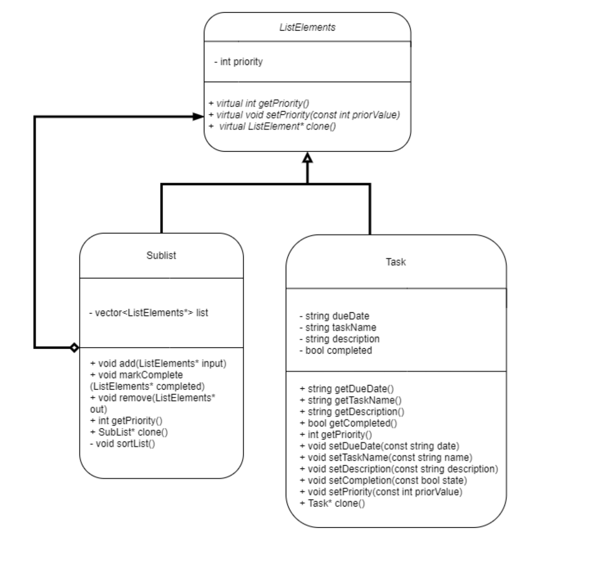

# Task Scheduler - rdudh001_fzaki001_alee447

 Authors: [Rishab Dudhia](https://github.com/rishabdudhia)
          , [Fadi Zaki](https://github.com/fadi001)
	  , [Adwin Lee](https://github.com/aklee98)

## Project Description

Being college students during this pandemic we have realized the importance of time management and organization. Therefore, we want to create a task manager that will keep students organized while managing these tough times.

Languages and tools:
* C++ - Programming language that will be the main language used for this project. C++ is an extension of the C programming language
* [git](https://git-scm.com)
* [Github](https://github.com)
* [Valgrind](https://valgrind.org)

The input of our project will be the client typing in certain tasks with the options to add a priority level and a due date. The output of the project will be a list of tasks that need to be completed, ranked by priority. The client can also make subtasks that will also have priority levels and due dates.

Prototype - 
	One of the design patterns we chose to use in this project is Prototype. We chose this pattern because it will allow us to clone a list without having to fill out a whole new list or know what any of the sublists or tasks are. For example, this will allow the user to copy their tasks from week A to week B without having to re-enter the items on the list or worry about forgetting to add any sublist or task they may have not completed from the week before. The problem we anticipate encountering while implementing this project is that some of the data that the feature will try to copy from week A to week B will be private and access to all the sublists (subclasses) being copied. We will need to use a prototype to clone the objects because it will allow us to use the same class and create a new object which can still access the old private section of the object we want to clone and copy all the data into itself.

Composite -
	One pattern that we will use that will be instrumental to the project will be Composite. With the composite design pattern, we can create lists that can be made up of tasks or sublists that can contain tasks or even more sublists. One problem we anticipate encountering while implementing the project is the difficulty of creating objects that are derived from a base class so that we can treat tasks, sublists, and lists all as the same in a common interface. The composite design pattern solves this problem as it allows us to treat all objects similarly, and they will still act appropriately due to their inheritance from a base class. 
 

## Class Diagram
The first OMT diagram we tried to produce contained two distinct diagrams connected by an inheritance. One diagram being the OMT diagram for the composite design pattern which contained the classes ListElements, SubLists, and Tasks. The second diagram was the diagram for the prototype design pattern which contained the classes PrototypeInterface, ConcretePrototype_SubLists, and ConcretePrototype_Tasks. The PrototypeInterface class inherited from the SubLists class to try to get the SubLists functions available to the prototype objects so that they could be treated as ListElements after being created. However, we realized that only the SubLists members would be available to the prototypes and not the Tasks’ members. After doing some research, we came upon the solution to add a “clone()” function into our existing classes within just the composite design pattern and having no classes for the prototype design pattern since the copying of objects will be done within their own classes. Furthermore, this allows the clone() function to be a pure virtual function of the ListElements class which would mean that we are also implementing the strategy design pattern. We realized after making our final OMT diagram that we are unconsciously applying the strategy pattern as the determination of which clone function will be run will occur at run time. 

Original OMT:

Final OMT:

 
 > ## Phase III
 > You will need to schedule a check-in with the TA (during lab hours or office hours). Your entire team must be present. 
 > * Before the meeting you should perform a sprint plan like you did in Phase II
 > * In the meeting with your TA you will discuss: 
 >   - How effective your last sprint was (each member should talk about what they did)
 >   - Any tasks that did not get completed last sprint, and how you took them into consideration for this sprint
 >   - Any bugs you've identified and created issues for during the sprint. Do you plan on fixing them in the next sprint or are they lower priority?
 >   - What tasks you are planning for this next sprint.

 > ## Final deliverable
 > All group members will give a demo to the TA during lab time. The TA will check the demo and the project GitHub repository and ask a few questions to all the team members. 
 > Before the demo, you should do the following:
 > * Complete the sections below (i.e. Screenshots, Installation/Usage, Testing)
 > * Plan one more sprint (that you will not necessarily complete before the end of the quarter). Your In-progress and In-testing columns should be empty (you are not doing more work currently) but your TODO column should have a full sprint plan in it as you have done before. This should include any known bugs (there should be some) or new features you would like to add. These should appear as issues/cards on your Kanban board. 
 
 ## Screenshots
 > Screenshots of the input/output after running your application
 ## Installation/Usage
 > Instructions on installing and running your application
 ## Testing
 > How was your project tested/validated? If you used CI, you should have a "build passing" badge in this README.
 
